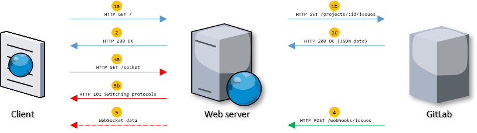

# Assignment B2 - Realtime Web Application

In this assignment, you will be writing a web application that includes realtime web technologies such as WebSocket and webhook. You must put the application into production on a public server. 

The idea behind the application is that you should be able to list [issues](https://docs.gitlab.com/ee/user/project/issues/) from a GitLab repository that you create yourself in the group "Assignment B2" (e.g., <https://gitlab.lnu.se/1dv026/student/xx222xx/assignment-b2/>). You have "manager" access to this group so that you can create projects and test the application by creating issues (and comments), and include these in your application through the [GitLab API](https://docs.gitlab.com/ee/api/api_resources.html) and [webhooks](https://docs.gitlab.com/ee/user/project/integrations/webhooks.html).

The web application must be a Node.js application that uses Express as the application framework. You must follow the course's coding standard. You must split your source code into several modules. Of course, you need to document and comment on the source code. (#5, #1, #4)

After cloning the repository with the application's source code and running `npm install`, it must be easy to lint the source code and run the application. Therefore, be sure to add the script start and lint to the "scripts" field in the package.json file. (#3)

You must use the repository created for you and this assignment and make continuous commits to make it is possible to follow the web application's creation. Make sure that no more files than necessary are committed to the repository. (#6)

To announce that you have completed the assignment, you must make a merge request of your assignment at its repository on GitLab (release-branch).

## The web application

The image above explains the web application's architecture.

1. When a client connects to the application, it will use the GitLab API, a REST API, to fetch your [project's issues](https://docs.gitlab.com/ee/api/issues.html#list-project-issues). (#12)
2. When your application has retrieved the issues from your repository, the application should render the issues into HTML along with the JavaScript needed and send it all as a response to the client. (#12)
3. One thing the client script needs to do is, for example, to connect to your server's WebSocket channel. (#13)
4. You must configure your GitLab repository to fire a webhook for your application to receive when a new issue event occurs in said repository. (#13)
5. The application must use the WebSocket channel(s) to transmit the received and transformed payload to the client in realtime. (#13)

When the application is running, the user must also be able to:

* Close issues from the client-side application. (#14)
* Do one more thing towards the issues. You decide this yourself. (#14)

You are free to choose and use third-party packages to solve the problem, but they should be mentioned and motivated in your assignment report and included in package.json.

If a user requests a non-existent resource, the application must return the HTTP status code 404 (Not Found). The HTTP status code 500 (Internal Server Error) must only be returned when necessary. (#8)

As far as possible, be sure to protect the application from vulnerable attacks. (#9)

The application should be deployed on a given server in CSCloud. (#7)

API-keys and webhook tokens should be stored in environment variables and not shared with anyone. (#10)

When handing in the assignment, the assignment report must be answered. (#11)

## Resources

To solve the assignment, you may do some reading in the documentation at GitLab.

* [GitLab, Issues API](https://docs.gitlab.com/ee/api/issues.html)
* [GitLab, Webhooks](https://docs.gitlab.com/ee/user/project/integrations/webhooks.html)
* [GitLab, Webhook events, Issue events](https://docs.gitlab.com/ee/user/project/integrations/webhook_events.html#issue-events)

## Requirements

Make sure to read [all requirements of the application](../../issues/). This includes: (#1, #2, #3, #4, #5, #6, #7, #8, #9, #10, #11, #12, #13, #14)
Pay extra attention to the labels indicating if the requirement is required (~"req::required") or optional (~"req::optional").

In this assignment, you are required to close issues and tasks ([ ]) that you implement. You must also create issues (and close them) for added functionality.
